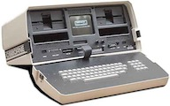

!SLIDE subsection

# CoffeeScript for Rubyists

Brian Morearty

Jan. 5, 2012

.notes Is CoffeeScript really so great? Why use it instead of good ol' JavaScript?

!SLIDE

# This Talk

* Too many slides
  * Some are for reference
* Save questions for the end
  * Or talk fast

!SLIDE incremental

# Who Am I?

* Programming since 1982 
* Former lead eng. of QuickBooks UI
* Co-founder of a new startup
* And an independent consultant

!SLIDE incremental

# Why Am I Talking About CoffeeScript?

* I like concise languages
* Doing CoffeeScript for 6 months
* In Rails 3.0 and 3.1 apps

!SLIDE subsection

# What I Will Talk About

!SLIDE

# CoffeeScript (duh)
* How to install it
* Using it in a pre-3.1 Rails app
* Dealing with legacy JavaScript
* Why Ruby programmers might like CoffeeScript

!SLIDE

# Bonus

* ONE thing about CoffeeScript that's better than Ruby

!SLIDE

# But First

!SLIDE

# What is CoffeeScript?

* A language that compiles to JavaScript
* Whitespace is significant
* Compiled JS output is pretty-printed
* Can use JS libraries (and vice-versa)
* There is no interpretation at runtime

